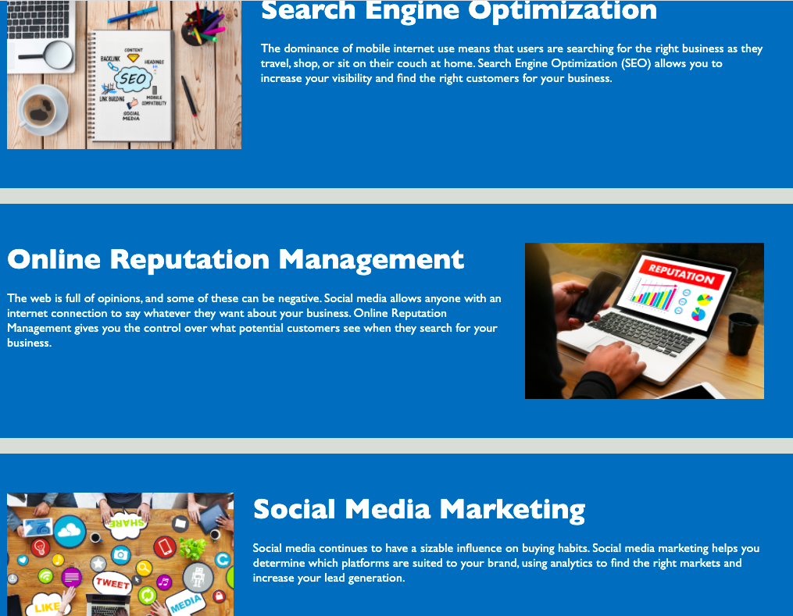
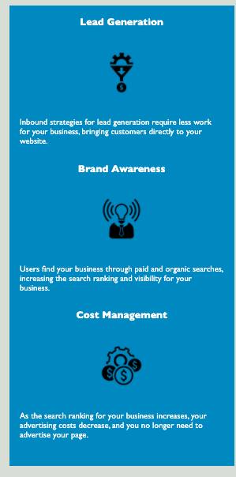

# Horiseon Webpage

This is the initial contact Horiseon makes with customers. To communicate a clear message to the clients we want to deploy a clean and simple, yet attractive website.

## Navigation Bar

* The navigation bar allows the client to quickly jump to the portion of the page they need.

* The navigation connects you to:
    * Search Engine Optimization
    * Online Reputation Management
    * Social Media Marketing

# Right Column Utilization

* The right column explains the way in which the three topics above are achieved
    * Via Lead Generation
        - Achieved through inbound strategies so customers come to the clinet
    * Brand awareness
        - Users find our clients via paid web searches
        - Emphasis on visibility for the business
    * Cost management
        - By utilizing Horiseon services the client will come to a point where Horiseon is no longer needed

